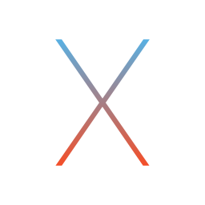

  

<h1 align="center">Hi 👋, I'm Alessandro</h1>
<h3 align="center">A Cyber Security Engineer graduated in University of Naples Federico II</h3>

<!-- 
  
 -->

- 📚 I'm graduated in _Cyber Security and Computer Engineering_ with a thesis on **Emulation of Post-Exploitation Attack Scenarios based on Cyber Threat Intelligence** in December 2022.

- 🎖️ I hold the **eLearnSecurity Certified Professional Penetration Tester** ([eCPPT](https://ine.com/learning/certifications/external/elearnsecurity-mobile-application-penetration-tester)) certification.
 
- 👨‍💻 All of my projects are available at [Repositories](https://github.com/Aledangelo?tab=repositories).

- 📫 How to reach me **alessandrodangelo.work@gmail.com**.

&nbsp;

<h3 align="left">Badges and Certifications:</h3>

   

<h3 align="left">Connect with me:</h3>

   
   

<h3 align="left">Operative Systems:</h3>

  
  
  
  
  
  

<h3 align="left">Programming Languages:</h3>

<h3 align="left">Virtualization:</h3>

<h3 align="left">Frameworks and Tools:</h3>

 

 

 

 
  
 

<h3 align="left">Cloud Services:</h3>

 

<h3 align="left">Databases:</h3>

 
 

<!-- 

 -->
<h3 align="left">CTF tools:</h3>

 

